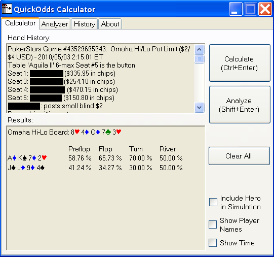
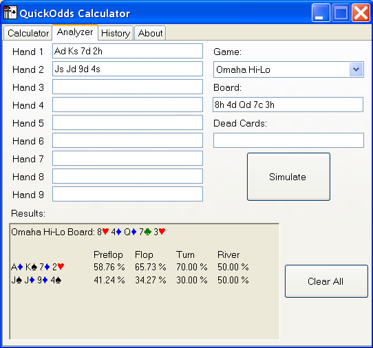
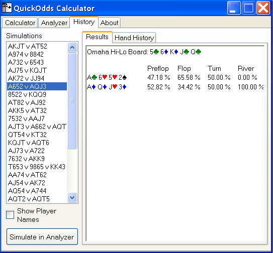

# QuickOdds Calculator

A tool to scrape poker hand histories and calculate comprehensive round-by-round odds in real time. *This tool has not been updated since 2011 and may not be compatible with newer hand history formats in its current state.*

## Features

* Reads hand histories from PokerStars, Full Tilt, and Absolute Poker.
* Simulates Hold 'em, Omaha Hi, or Omaha Hi-Lo hands quickly and with minimal user keystrokes or mouse clicks.
* Reads hand histories from text copied to clipboard.
* Reports expected value for each hand on every street.
* Detects side pots and performs separate simulations for the main pot and all side pots, taking dead cards into consideration.
* Can include Hero's folded hand in simulations to evaluate hypothetical hands.
* Includes analyzer that allows users to modify simulation parameters and evaluate hypothetical situations.
* Retains history of simulations for each session that can later be reviewed.

## Screenshots

